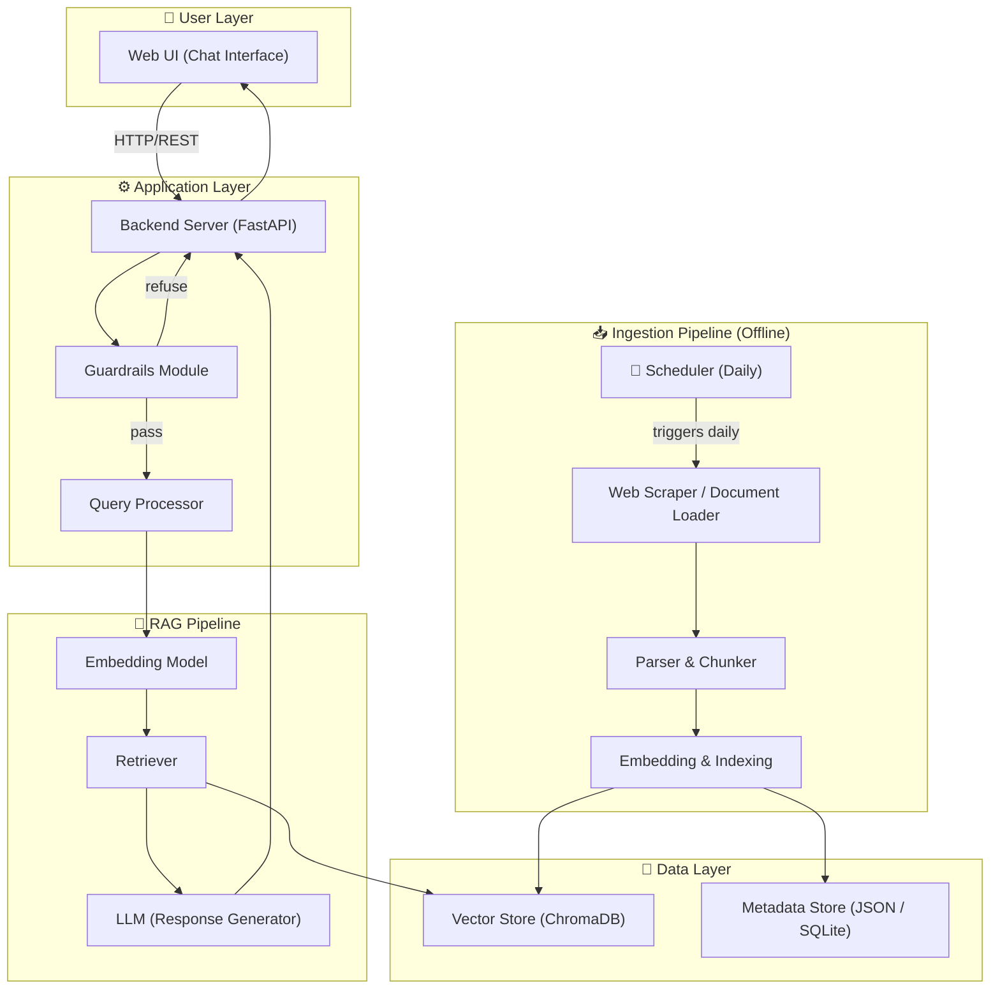
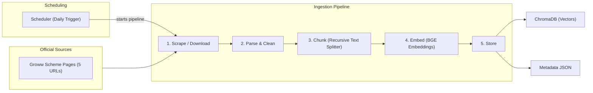
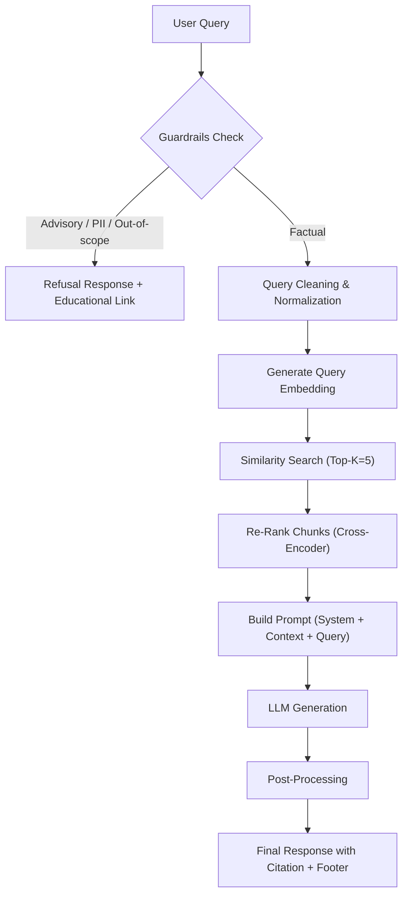
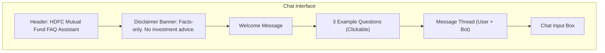
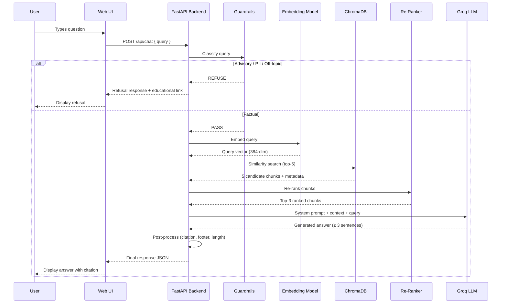
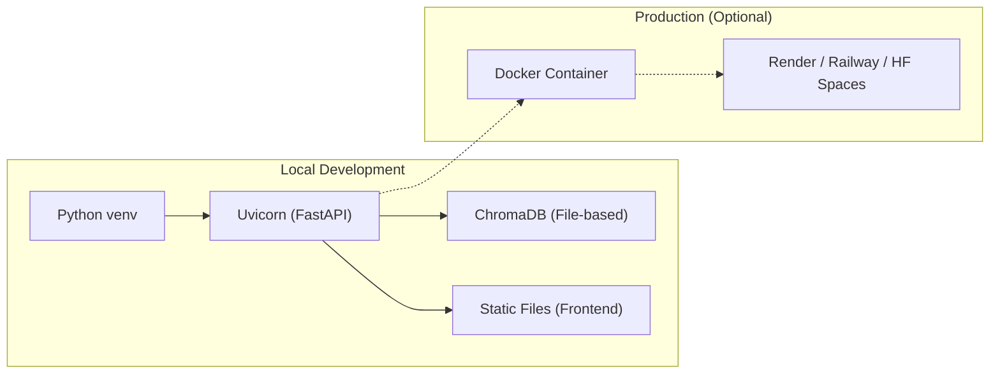

# Architecture — Mutual Fund FAQ Assistant (RAG Chatbot)

> This document describes the end-to-end system architecture for the **HDFC Mutual Fund Facts-Only FAQ Assistant**, built using a Retrieval-Augmented Generation (RAG) approach.

---

## 1. High-Level System Overview



### Flow Summary

| Step | Component | Action |
|------|-----------|--------|
| 1 | **Web UI** | User types a factual question |
| 2 | **Backend Server** | Receives the query via REST API |
| 3 | **Guardrails Module** | Classifies query as *factual* or *advisory/out-of-scope* |
| 4 | **Query Processor** | Cleans, normalizes, and optionally reformulates the query |
| 5 | **Embedding Model** | Converts the query into a dense vector |
| 6 | **Retriever** | Performs similarity search against the vector store |
| 7 | **LLM** | Generates a ≤ 3-sentence answer grounded in retrieved chunks |
| 8 | **Backend Server** | Attaches citation link + "Last updated" footer |
| 9 | **Web UI** | Renders the response to the user |

---

## 2. Component Architecture

### 2.1 Ingestion Pipeline (Offline / Batch)

The ingestion pipeline runs **offline** to build and refresh the knowledge base. It is not part of the real-time query path.



#### 2.1.1 Data Sources

| Source Type | URLs | Format |
|---|---|---|
| Groww — HDFC Mid-Cap Fund | [Link](https://groww.in/mutual-funds/hdfc-mid-cap-fund-direct-growth) | HTML (web scrape) |
| Groww — HDFC Equity Fund | [Link](https://groww.in/mutual-funds/hdfc-equity-fund-direct-growth) | HTML (web scrape) |
| Groww — HDFC Focused Fund | [Link](https://groww.in/mutual-funds/hdfc-focused-fund-direct-growth) | HTML (web scrape) |
| Groww — HDFC ELSS Tax Saver Fund | [Link](https://groww.in/mutual-funds/hdfc-elss-tax-saver-fund-direct-plan-growth) | HTML (web scrape) |
| Groww — HDFC Large Cap Fund | [Link](https://groww.in/mutual-funds/hdfc-large-cap-fund-direct-growth) | HTML (web scrape) |

#### 2.1.2 Parsing & Chunking Strategy

| Parameter | Value | Rationale |
|---|---|---|
| **Chunk size** | 500 tokens | Balances context richness with retrieval precision |
| **Chunk overlap** | 50 tokens | Preserves context continuity at boundaries |
| **Splitter** | `RecursiveCharacterTextSplitter` | Respects paragraph and sentence boundaries |
| **HTML parser** | `BeautifulSoup` + custom selectors | Extracts structured content from Groww scheme pages |

#### 2.1.3 Metadata per Chunk

Each chunk is stored with the following metadata:

```json
{
  "chunk_id": "hdfc_midcap_factsheet_chunk_003",
  "scheme_name": "HDFC Mid-Cap Fund – Direct Growth",
  "source_type": "factsheet",
  "source_url": "https://www.hdfcfund.com/...",
  "document_title": "HDFC Mid-Cap Fund Factsheet – June 2026",
  "page_number": 2,
  "ingestion_date": "2026-07-08",
  "last_verified_date": "2026-07-08"
}
```

---

### 2.2 Query Pipeline (Online / Real-Time)



#### 2.2.1 Guardrails Module

The guardrails module is the **first checkpoint** for every incoming query. It enforces compliance constraints before any retrieval occurs.

| Check | Method | Action on Trigger |
|---|---|---|
| **Advisory detection** | Keyword list + LLM classifier | Refuse with polite message + AMFI/SEBI link |
| **PII detection** | Regex patterns (PAN, Aadhaar, phone, email, OTP) | Refuse and warn user; do not log the query |
| **Off-topic detection** | Intent classifier (out-of-domain) | Refuse with scope clarification |
| **Profanity / abuse** | Keyword filter | Refuse with neutral message |

**Refusal response template:**

```
I'm a facts-only assistant and cannot provide investment advice or opinions.

For guidance on mutual fund investing, please visit:
🔗 https://www.amfiindia.com/investor-corner/knowledge-center

Facts-only. No investment advice.
```

#### 2.2.2 Retriever

| Parameter | Value |
|---|---|
| **Search type** | Dense vector similarity (cosine) |
| **Top-K retrieval** | 5 chunks |
| **Re-ranking** | Cross-encoder re-ranker (top 3 after re-rank) |
| **Minimum similarity threshold** | 0.65 |
| **Fallback** | "I don't have enough information to answer this from my sources." |

#### 2.2.3 Prompt Engineering

The LLM prompt enforces all response constraints:

```
SYSTEM PROMPT:
You are a facts-only mutual fund FAQ assistant for HDFC AMC schemes.

RULES:
1. Answer ONLY using the provided context. Do NOT use prior knowledge.
2. Keep your answer to a MAXIMUM of 3 sentences.
3. Include EXACTLY ONE source citation URL from the context metadata.
4. End every response with: "Last updated from sources: <date>"
5. If the context does not contain the answer, say:
   "I don't have enough information to answer this from my sources."
6. NEVER provide investment advice, opinions, or recommendations.
7. NEVER compare fund performance or calculate returns.

CONTEXT:
{retrieved_chunks}

USER QUESTION:
{query}
```

#### 2.2.4 Post-Processing

| Step | Description |
|---|---|
| **Citation validation** | Verify the cited URL exists in chunk metadata |
| **Footer injection** | Append `"Last updated from sources: <date>"` using `last_verified_date` |
| **Length check** | Ensure response ≤ 3 sentences; truncate if needed |
| **Hallucination guard** | Cross-check key facts (expense ratio, exit load) against metadata if available |

---

### 2.3 User Interface

A minimal, clean chat interface.



**Example questions displayed on load:**

1. *"What is the expense ratio of HDFC Mid-Cap Fund – Direct Growth?"*
2. *"What is the lock-in period for HDFC ELSS Tax Saver Fund?"*
3. *"How do I download my capital gains statement from HDFC AMC?"*

---

### 2.4 Scheduler Component (Offline Trigger)

The scheduler component is implemented as an automated GitHub Actions workflow that runs daily. It executes the scraping, parsing, chunking, and vector store indexing steps to ensure data freshness (NAV, AUM, returns).

#### 2.4.1 Scheduler Design

- **Scheduled Trigger**: A GitHub Actions workflow (`.github/workflows/daily_ingestion.yml`) configured to run on a daily cron schedule and supports manual triggers (`workflow_dispatch`).
- **Data Persistence**: When the workflow runs successfully, it automatically commits and pushes the updated `data/` and `vectorstore/chroma_db/` files back to the repository branch, keeping the application's knowledge base fresh.

#### 2.4.2 Ingestion Chain Execution
The scheduler executes the following tasks in sequence:
1. **`download_sources.py`**: Fetches fresh HTML pages from the URL registry.
2. **`extract_text.py`**: Parses the Next.js script payload, updates processed `.json` and `.txt` files.
3. **`run_ingestion.py`**: Chunks the newly updated text, embeds the passages, and upserts them into ChromaDB.

#### 2.4.3 Error Handling & Alerting
- If any script in the ingestion chain fails, the workflow run is marked as failed, logging the traceback.
- The `data/metadata.json` stores the timestamp of the last successful run, which is exposed via the FastAPI `/api/health` endpoint for monitoring.

---

## 3. Technology Stack

| Layer | Technology | Justification |
|---|---|---|
| **Frontend** | HTML + CSS + Vanilla JS | Lightweight; meets "minimal UI" requirement |
| **Backend** | Python + FastAPI | Async support, easy REST APIs, lightweight |
| **Embedding Model** | `BAAI/bge-small-en-v1.5` | Fast, lightweight, strong retrieval quality (384-dim), open-source |
| **Vector Store** | ChromaDB | Local, serverless, simple Python API, persistent storage |
| **Re-Ranker** | `cross-encoder/ms-marco-MiniLM-L-6-v2` | Improves retrieval precision with minimal latency |
| **LLM** | Groq API (`llama-3.3-70b-versatile`) | Ultra-fast inference, generous free tier, strong instruction following |
| **Scheduling** | GitHub Actions | Scheduled daily cron workflow with automatic repository data commit |
| **HTML Scraping** | `BeautifulSoup4` + `requests` | Reliable, well-documented |
| **Chunking** | LangChain `RecursiveCharacterTextSplitter` | Smart boundary-aware splitting |
| **Orchestration** | LangChain | RAG chain composition, prompt templates |

---

## 4. Project Directory Structure

```
RAG_CHATBOT/
├── .github/
│   └── workflows/
│       └── daily_ingestion.yml    # Daily scheduler workflow
├── problemStatement.md
├── problemStatement.txt
├── architecture.md
├── README.md
│
├── data/                          # Raw & processed data
│   ├── raw/                       # Downloaded HTML from Groww
│   │   └── groww/                 # 5 scheme page HTMLs
│   ├── processed/                 # Cleaned text files
│   └── metadata.json              # Source URL → doc mapping
│
├── vectorstore/                   # ChromaDB persistent storage
│   └── chroma_db/
│
├── src/                           # Application source code
│   ├── __init__.py
│   ├── config.py                  # Environment variables, constants
│   ├── ingestion/
│   │   ├── __init__.py
│   │   ├── scraper.py             # Web scraping (Groww HTML pages)
│   │   ├── chunker.py             # Text chunking logic
│   │   └── indexer.py             # Embedding + ChromaDB insertion
│   ├── pipeline/
│   │   ├── __init__.py
│   │   ├── guardrails.py          # Query classification & PII detection
│   │   ├── retriever.py           # Vector search + re-ranking
│   │   ├── prompt_builder.py      # System prompt construction
│   │   ├── generator.py           # LLM call + response generation
│   │   └── postprocessor.py       # Citation validation, footer, length check
│   └── api/
│       ├── __init__.py
│       ├── main.py                # FastAPI app entry point
│       ├── routes.py              # API route definitions
│       └── models.py              # Pydantic request/response schemas
│
├── frontend/                      # Static web UI
│   ├── index.html
│   ├── style.css
│   └── app.js
│
├── scripts/                       # Utility scripts
│   ├── run_ingestion.py           # One-command corpus ingestion
│   ├── verify_vectorstore.py      # Sanity check on stored vectors
│   └── trigger_ingestion.py       # Orchestrates download → extract → run_ingestion
│
├── tests/                         # Test suite
│   ├── test_guardrails.py
│   ├── test_retriever.py
│   ├── test_generator.py
│   └── test_e2e.py
│
├── .env.example                   # Environment variable template
├── requirements.txt               # Python dependencies
└── .gitignore
```

---

## 5. API Contract

### `POST /api/chat`

**Request:**

```json
{
  "query": "What is the expense ratio of HDFC Mid-Cap Fund?",
  "session_id": "optional-uuid"
}
```

**Response (Factual):**

```json
{
  "status": "success",
  "type": "factual",
  "answer": "The expense ratio of HDFC Mid-Cap Fund – Direct Growth is 1.07% (as of June 2026).",
  "citation": {
    "url": "https://www.hdfcfund.com/mutual-fund/equity/hdfc-mid-cap-opportunities-fund",
    "title": "HDFC Mid-Cap Fund Factsheet"
  },
  "footer": "Last updated from sources: 2026-07-08",
  "confidence": 0.92
}
```

**Response (Refusal):**

```json
{
  "status": "refused",
  "type": "advisory",
  "answer": "I'm a facts-only assistant and cannot provide investment advice or opinions.",
  "educational_link": {
    "url": "https://www.amfiindia.com/investor-corner/knowledge-center",
    "title": "AMFI Investor Education"
  },
  "footer": "Facts-only. No investment advice."
}
```

### `GET /api/health`

Returns service health and vector store statistics.

```json
{
  "status": "healthy",
  "vectorstore_docs": 342,
  "last_ingestion": "2026-07-08T14:30:00Z",
  "last_ingestion_status": "success",
  "model": "llama-3.3-70b-versatile"
}
```


---

## 6. Data Flow — End to End



---

## 7. Security & Compliance Guardrails

### 7.1 PII Detection Patterns

```python
PII_PATTERNS = {
    "pan":     r"[A-Z]{5}[0-9]{4}[A-Z]",
    "aadhaar": r"\b\d{4}\s?\d{4}\s?\d{4}\b",
    "phone":   r"\b[6-9]\d{9}\b",
    "email":   r"[a-zA-Z0-9._%+-]+@[a-zA-Z0-9.-]+\.[a-zA-Z]{2,}",
    "otp":     r"\b\d{4,6}\b"  # combined with context keywords
}
```

### 7.2 Advisory Query Detection Keywords

```python
ADVISORY_KEYWORDS = [
    "should i invest", "which is better", "recommend",
    "best fund", "good fund", "worth investing",
    "better returns", "compare performance", "will it grow",
    "buy or sell", "safe to invest", "risk worth taking"
]
```

### 7.3 Compliance Checklist

| Rule | Implementation |
|---|---|
| No investment advice | Guardrails classifier + system prompt |
| No PII storage | Regex detection; blocked queries are never logged |
| Source-only answers | LLM system prompt restricts to retrieved context |
| Citation required | Post-processor validates citation URL exists |
| Max 3 sentences | Post-processor enforces sentence count |
| Last updated footer | Auto-appended from chunk metadata |

---

## 8. Deployment Architecture



### Local Setup

```bash
# 1. Clone & install
git clone <repo-url> && cd RAG_CHATBOT
python -m venv venv && source venv/bin/activate  # or venv\Scripts\activate on Windows
pip install -r requirements.txt

# 2. Set environment variables
cp .env.example .env
# Edit .env with your GROQ_API_KEY

# 3. Run ingestion (one-time)
python scripts/run_ingestion.py

# 4. Start the server
uvicorn src.api.main:app --reload --port 8000

# 5. Open the UI
# Navigate to http://localhost:8000
```

---

## 9. Performance & Scalability Considerations

| Aspect | Target | Strategy |
|---|---|---|
| **Query latency** | < 3 seconds end-to-end | Lightweight embedding model + local vector store |
| **Corpus size** | 15–25 documents, ~300–500 chunks | ChromaDB handles this easily in-memory |
| **Concurrent users** | 5–10 (dev) | FastAPI async handlers |
| **LLM cost** | Minimal | Groq free tier; ultra-fast inference, short prompts (≤ 1K tokens context) |
| **Freshness** | Monthly refresh | Re-run ingestion script when factsheets update |

---

## 10. Known Limitations & Mitigations

| Limitation | Mitigation |
|---|---|
| Factsheet data can become stale | Monthly re-ingestion; "Last updated" footer signals data age |
| PDF tables may not parse perfectly | Use `pdfplumber` for table extraction; manual QA on critical data |
| LLM may hallucinate despite grounding | Post-processing cross-checks key numeric facts; low-confidence fallback |
| OTP regex may over-match short numbers | Combine with context keyword detection ("otp", "verification") |
| Limited to 5 HDFC schemes | Architecture supports easy expansion by adding URLs to corpus config |
| No conversation memory | Single-turn Q&A by design; keeps responses focused and compliant |
