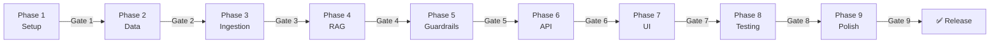
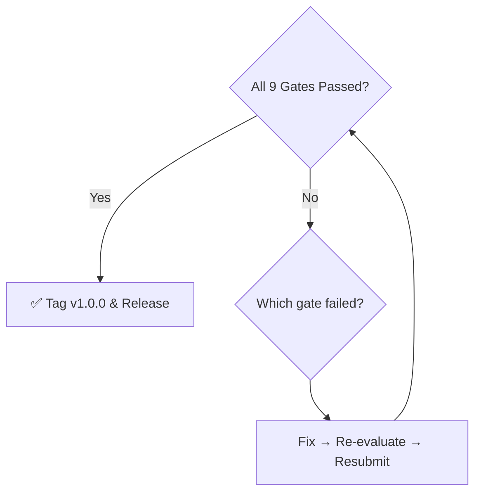

# Evaluation Plan — Mutual Fund FAQ Assistant (RAG Chatbot)

> Phase-by-phase evaluation criteria, test cases, metrics, and pass/fail gates derived from [implementation_plan.md](file:///d:/RAG_CHATBOT/implementation_plan.md). Every phase must clear its evaluation gate before the next phase begins.

---

## Evaluation Overview



| Symbol | Meaning |
|--------|---------|
| ✅ | Pass — criterion fully met |
| ⚠️ | Partial — acceptable with documented workaround |
| ❌ | Fail — must fix before proceeding |

---

## Phase 1 — Project Setup & Configuration

### Evaluation Criteria

| # | Criterion | Method | Pass Condition | Result |
|---|-----------|--------|----------------|--------|
| 1.1 | Directory structure matches architecture | Manual comparison against `architecture.md` § 4 | All 12 directories exist | |
| 1.2 | Virtual environment created | `python -m venv venv` | `venv/` directory exists; activates without error | |
| 1.3 | Dependencies install cleanly | `pip install -r requirements.txt` | Exit code 0; no dependency resolution errors | |
| 1.4 | Config module imports | `python -c "from src.config import *"` | Exit code 0; all config variables accessible | |
| 1.5 | `.env.example` complete | Manual review | Contains `GROQ_API_KEY`, `EMBEDDING_MODEL_NAME`, `CHROMA_PERSIST_DIR` at minimum | |
| 1.6 | `.gitignore` configured | Manual review | Covers `venv/`, `.env`, `__pycache__/`, `vectorstore/`, `data/raw/` | |
| 1.7 | Package init files | `find src -name "__init__.py"` | Present in `src/`, `src/ingestion/`, `src/pipeline/`, `src/api/` | |

### Automated Verification Script

```bash
# Run from project root
echo "=== Phase 1 Eval ==="

# 1.1 Directory structure
for dir in src src/ingestion src/pipeline src/api data data/raw data/processed vectorstore frontend scripts tests; do
  [ -d "$dir" ] && echo "✅ $dir" || echo "❌ $dir MISSING"
done

# 1.3 Dependencies
pip install -r requirements.txt --dry-run 2>&1 | tail -1

# 1.4 Config import
python -c "from src.config import *; print('✅ Config imports OK')" 2>&1 || echo "❌ Config import failed"

# 1.7 Init files
for pkg in src src/ingestion src/pipeline src/api; do
  [ -f "$pkg/__init__.py" ] && echo "✅ $pkg/__init__.py" || echo "❌ $pkg/__init__.py MISSING"
done
```

### Gate 1 — Pass Condition

> **All 7 criteria must be ✅.** No partial passes allowed for project skeleton.

---

## Phase 2 — Data Collection & Corpus Building

### Evaluation Criteria

| # | Criterion | Method | Pass Condition | Result |
|---|-----------|--------|----------------|--------|
| 2.1 | Source count | Count entries in `data/metadata.json` | 15 ≤ count ≤ 25 | |
| 2.2 | Source diversity | Inspect `metadata.json` source types | ≥ 3 distinct source types (scheme_page, factsheet, kim, faq, etc.) | |
| 2.3 | Scheme coverage | Group sources by `scheme` field | Each of the 5 HDFC schemes has ≥ 2 sources | |
| 2.4 | Source legitimacy | Manual review of all URLs | 100% official sources (AMC, AMFI, SEBI, Groww); 0 third-party | |
| 2.5 | Raw data downloaded | Check `data/raw/` directory | ≥ 15 files present (HTML + PDF) | |
| 2.6 | Files readable | Attempt to open each file | 0 corrupt or empty files | |
| 2.7 | Metadata schema valid | JSON schema validation | Each entry has: `id`, `url`, `type`, `format`, `scheme` | |

### Source Validation Checklist

| # | URL Domain | Allowed? | Justification |
|---|-----------|----------|---------------|
| 1 | `groww.in` | ✅ | Reference product context |
| 2 | `hdfcfund.com` | ✅ | Official AMC site |
| 3 | `amfiindia.com` | ✅ | Industry body |
| 4 | `sebi.gov.in` | ✅ | Regulator |
| 5 | `moneycontrol.com` | ❌ | Third-party aggregator |
| 6 | `valueresearchonline.com` | ❌ | Third-party |
| 7 | `economictimes.com` | ❌ | News / blog |
| 8 | Any other domain | ❌ | Must be approved case-by-case |

### Automated Verification Script

```python
import json

with open("data/metadata.json") as f:
    meta = json.load(f)

sources = meta["sources"]

# 2.1 Source count
assert 15 <= len(sources) <= 25, f"❌ Source count: {len(sources)} (need 15-25)"
print(f"✅ Source count: {len(sources)}")

# 2.2 Source diversity
types = set(s["type"] for s in sources)
assert len(types) >= 3, f"❌ Only {len(types)} source types: {types}"
print(f"✅ Source types: {types}")

# 2.3 Scheme coverage
from collections import Counter
scheme_counts = Counter(s["scheme"] for s in sources)
for scheme, count in scheme_counts.items():
    status = "✅" if count >= 2 else "❌"
    print(f"{status} {scheme}: {count} sources")

# 2.4 Source legitimacy
ALLOWED_DOMAINS = ["groww.in", "hdfcfund.com", "amfiindia.com", "sebi.gov.in"]
for s in sources:
    domain_ok = any(d in s["url"] for d in ALLOWED_DOMAINS)
    status = "✅" if domain_ok else "❌"
    print(f"{status} {s['url'][:60]}...")

# 2.7 Metadata schema
REQUIRED_FIELDS = ["id", "url", "type", "format", "scheme"]
for s in sources:
    missing = [f for f in REQUIRED_FIELDS if f not in s]
    if missing:
        print(f"❌ {s['id']}: missing {missing}")
    else:
        print(f"✅ {s['id']}: schema valid")
```

### Gate 2 — Pass Condition

> **Criteria 2.1–2.4 must be ✅. Criteria 2.5–2.7 allow ⚠️** (e.g., 1 file may be temporarily unavailable if logged).

---

## Phase 3 — Ingestion Pipeline

### Evaluation Criteria

| # | Criterion | Method | Pass Condition | Result |
|---|-----------|--------|----------------|--------|
| 3.1 | Ingestion script runs | `python scripts/run_ingestion.py` | Exit code 0; no uncaught exceptions | |
| 3.2 | Chunk count | `python scripts/verify_vectorstore.py` | 300 ≤ chunks ≤ 500 | |
| 3.3 | Chunk metadata complete | Sample 10 random chunks | All have: `chunk_id`, `scheme_name`, `source_url`, `ingestion_date` | |
| 3.4 | Chunk size compliance | Measure token count of 20 random chunks | 95% of chunks ≤ 500 tokens | |
| 3.5 | Chunk overlap functional | Inspect adjacent chunks from same doc | Overlapping text visible at boundaries | |
| 3.6 | HTML scraper quality | Compare scraped text vs. original page | Main content extracted; no nav/footer/ad text | |
| 3.7 | PDF parser quality | Compare extracted text vs. original PDF | Key data (expense ratio, exit load, AUM) correctly extracted | |
| 3.8 | No duplicate chunks | Hash all chunk texts | 0 exact duplicates | |
| 3.9 | Vector store persistence | Restart Python process, reload collection | Same chunk count after restart | |
| 3.10 | Sample similarity search | Query: "expense ratio" | Top-3 results contain expense ratio data | |

### PDF Extraction Quality Matrix

| Document | Key Field | Expected Value | Extracted Correctly? | Result |
|----------|-----------|----------------|---------------------|--------|
| HDFC Mid-Cap Factsheet | Expense ratio | e.g., 1.07% | | |
| HDFC Mid-Cap Factsheet | AUM | e.g., ₹45,000 Cr | | |
| HDFC Mid-Cap Factsheet | Benchmark | e.g., Nifty Midcap 150 TRI | | |
| HDFC Equity Factsheet | Fund Manager | e.g., Roshi Jain | | |
| HDFC ELSS KIM | Lock-in period | 3 years | | |
| HDFC Large Cap KIM | Exit load | e.g., 1% within 1 year | | |
| HDFC Focused SID | Investment objective | Paragraph of text | | |

### Automated Verification Script

```python
import chromadb

client = chromadb.PersistentClient(path="./vectorstore/chroma_db")
collection = client.get_collection("mutual_fund_faq")

# 3.2 Chunk count
count = collection.count()
assert 300 <= count <= 500, f"❌ Chunk count: {count}"
print(f"✅ Chunk count: {count}")

# 3.3 Metadata completeness (sample 10)
sample = collection.get(limit=10, include=["metadatas"])
REQUIRED = ["chunk_id", "scheme_name", "source_url", "ingestion_date"]
for meta in sample["metadatas"]:
    missing = [f for f in REQUIRED if f not in meta]
    if missing:
        print(f"❌ Chunk {meta.get('chunk_id', '?')}: missing {missing}")
    else:
        print(f"✅ Metadata complete: {meta['chunk_id']}")

# 3.8 Duplicate check
all_docs = collection.get(include=["documents"])
texts = all_docs["documents"]
unique = set(texts)
dupes = len(texts) - len(unique)
print(f"{'❌' if dupes > 0 else '✅'} Duplicates: {dupes}")

# 3.10 Sample similarity search
results = collection.query(query_texts=["expense ratio"], n_results=3)
for i, doc in enumerate(results["documents"][0]):
    has_expense = "expense" in doc.lower() or "ratio" in doc.lower()
    print(f"{'✅' if has_expense else '⚠️'} Result {i+1}: {'relevant' if has_expense else 'may not be relevant'}")
```

### Gate 3 — Pass Condition

> **Criteria 3.1–3.5, 3.8–3.10 must be ✅. Criteria 3.6–3.7 allow ⚠️** for non-critical fields (e.g., legal boilerplate).

---

## Phase 4 — RAG Query Pipeline

### Evaluation Criteria

| # | Criterion | Method | Pass Condition | Result |
|---|-----------|--------|----------------|--------|
| 4.1 | Retriever returns results | Test with 10 sample queries | Top-K results returned for all 10 | |
| 4.2 | Re-ranker improves relevance | Compare top-1 before/after re-ranking | Re-ranked top-1 is more relevant in ≥ 7/10 queries | |
| 4.3 | Similarity threshold works | Query: "weather forecast" (off-topic) | Returns 0 results above 0.65 threshold | |
| 4.4 | Prompt builder output | Inspect constructed prompt | Contains system rules + context + query; ≤ 1K tokens context | |
| 4.5 | LLM generates response | All 10 sample queries | Non-empty response for all 10 | |
| 4.6 | Response ≤ 3 sentences | Count sentences in all 10 responses | 100% compliance | |
| 4.7 | Citation present | Check all 10 responses | Each has exactly 1 citation URL | |
| 4.8 | Citation is valid | Cross-check URL against chunk metadata | URL exists in metadata for all 10 | |
| 4.9 | Footer present | Check all 10 responses | Each has "Last updated from sources: \<date\>" | |
| 4.10 | Fallback triggers | Query: "What is the NAV of XYZ Fund?" | Returns: "I don't have enough information..." | |

### 10-Query Factual Accuracy Test

| # | Query | Expected Answer Contains | Citation Source | ≤ 3 Sent. | Footer | Correct? |
|---|-------|--------------------------|-----------------|-----------|--------|----------|
| 1 | What is the expense ratio of HDFC Mid-Cap Fund? | A percentage value (e.g., "1.07%") | Factsheet / Groww | | | |
| 2 | What is the exit load for HDFC Equity Fund? | Duration + percentage (e.g., "1% within 1 year") | Factsheet / KIM | | | |
| 3 | What is the minimum SIP amount for HDFC Large Cap Fund? | Rupee amount (e.g., "₹500" or "₹100") | Groww / Factsheet | | | |
| 4 | What is the lock-in period for HDFC ELSS Tax Saver? | "3 years" | KIM / SID | | | |
| 5 | What is the benchmark index of HDFC Focused Fund? | Index name (e.g., "Nifty 500 TRI") | Factsheet | | | |
| 6 | What is the riskometer category of HDFC Mid-Cap Fund? | Risk level (e.g., "Very High") | Factsheet | | | |
| 7 | Who is the fund manager of HDFC Equity Fund? | Person name | Factsheet | | | |
| 8 | How to download capital gains statement? | Process steps or link to AMC portal | AMC FAQ | | | |
| 9 | What is the AUM of HDFC Large Cap Fund? | Currency amount (e.g., "₹X crore") | Factsheet | | | |
| 10 | What is the minimum lump sum for HDFC Focused Fund? | Rupee amount (e.g., "₹5,000") | KIM / Groww | | | |

### Quality Scoring

| Metric | Formula | Target | Result |
|--------|---------|--------|--------|
| **Factual Accuracy** | Correct answers / 10 | ≥ 8/10 (80%) | |
| **Citation Accuracy** | Valid citations / 10 | 10/10 (100%) | |
| **Format Compliance** | Responses with ≤ 3 sentences + footer / 10 | 10/10 (100%) | |
| **Retrieval Relevance** | Queries where top-1 chunk is relevant / 10 | ≥ 9/10 (90%) | |
| **Fallback Precision** | Correct fallbacks / total unanswerable queries | 100% | |

### Gate 4 — Pass Condition

> **Factual Accuracy ≥ 80%, Citation Accuracy = 100%, Format Compliance = 100%.** Retrieval Relevance ≥ 90%.

---

## Phase 5 — Guardrails & Compliance

### Evaluation Criteria

| # | Criterion | Method | Pass Condition | Result |
|---|-----------|--------|----------------|--------|
| 5.1 | PII detection — true positives | Test with known PII inputs | 100% detection rate (0 false negatives) | |
| 5.2 | PII detection — false positives | Test with factual queries containing numbers | ≤ 5% false positive rate | |
| 5.3 | Advisory detection — true positives | Test with advisory inputs | 100% detection rate | |
| 5.4 | Advisory detection — false positives | Test with factual queries containing "risk", "return" | ≤ 5% false positive rate | |
| 5.5 | Off-topic detection | Test with weather, sports, politics queries | 100% detected | |
| 5.6 | Refusal response format | Inspect refusal messages | Polite, clear, includes educational link | |
| 5.7 | PII not logged | Check log output after PII query | Query text NOT in logs; only "PII_BLOCKED" marker | |
| 5.8 | pytest passes | `pytest tests/test_guardrails.py` | 0 failures, ≥ 15 tests | |

### PII Detection Test Suite

| # | Input | PII Type | Expected | Result |
|---|-------|----------|----------|--------|
| 1 | `"My PAN is ABCDE1234F"` | PAN | 🚫 Block | |
| 2 | `"PAN ZZZZZ9999Z check"` | PAN | 🚫 Block | |
| 3 | `"Aadhaar 1234 5678 9012"` | Aadhaar | 🚫 Block | |
| 4 | `"UID 123456789012"` | Aadhaar | 🚫 Block | |
| 5 | `"Call me at 9876543210"` | Phone | 🚫 Block | |
| 6 | `"Phone: +91 8765432109"` | Phone | 🚫 Block | |
| 7 | `"Send to user@mail.com"` | Email | 🚫 Block | |
| 8 | `"OTP is 456789"` | OTP | 🚫 Block | |
| 9 | `"Verification code 1234"` | OTP | 🚫 Block | |
| 10 | `"What is the expense ratio?"` | None | ✅ Pass | |
| 11 | `"Lock-in is 3 years"` | None (number) | ✅ Pass | |
| 12 | `"AUM is 45000 crore"` | None (large number) | ✅ Pass | |
| 13 | `"Fund was launched in 2013"` | None (year) | ✅ Pass | |

### Advisory Detection Test Suite

| # | Input | Expected | Result |
|---|-------|----------|--------|
| 1 | `"Should I invest in HDFC Mid-Cap?"` | 🚫 Refuse | |
| 2 | `"Which fund is better?"` | 🚫 Refuse | |
| 3 | `"Recommend a good fund"` | 🚫 Refuse | |
| 4 | `"Is this fund worth investing?"` | 🚫 Refuse | |
| 5 | `"Compare HDFC Mid-Cap vs Large Cap"` | 🚫 Refuse | |
| 6 | `"Will this fund grow?"` | 🚫 Refuse | |
| 7 | `"Buy or sell HDFC Equity?"` | 🚫 Refuse | |
| 8 | `"Is it safe to invest?"` | 🚫 Refuse | |
| 9 | `"Is HDFC Mid-Cap a good choice for my retirement?"` | 🚫 Refuse | |
| 10 | `"What is the risk category of HDFC Mid-Cap?"` | ✅ Pass (factual) | |
| 11 | `"What is the expense ratio?"` | ✅ Pass (factual) | |
| 12 | `"What is the exit load?"` | ✅ Pass (factual) | |
| 13 | `"How to download capital gains?"` | ✅ Pass (factual) | |

### Gate 5 — Pass Condition

> **PII true positive rate = 100%, Advisory true positive rate = 100%, False positive rate ≤ 5%.** All pytest tests pass.

---

## Phase 6 — FastAPI Backend & API

### Evaluation Criteria

| # | Criterion | Method | Pass Condition | Result |
|---|-----------|--------|----------------|--------|
| 6.1 | Server starts | `uvicorn src.api.main:app --reload` | No import/startup errors; binds to port 8000 | |
| 6.2 | Health endpoint | `GET /api/health` | Returns JSON with `status`, `vectorstore_docs`, `model` | |
| 6.3 | Chat — factual | `POST /api/chat {"query": "expense ratio?"}` | Returns `status: "success"`, `type: "factual"`, valid `answer` | |
| 6.4 | Chat — advisory | `POST /api/chat {"query": "should I invest?"}` | Returns `status: "refused"`, `type: "advisory"` | |
| 6.5 | Chat — PII | `POST /api/chat {"query": "PAN ABCDE1234F"}` | Returns `status: "refused"`, `type: "pii"` | |
| 6.6 | Empty query | `POST /api/chat {"query": ""}` | Returns HTTP 422 or custom validation error | |
| 6.7 | Missing query field | `POST /api/chat {}` | Returns HTTP 422 with Pydantic error | |
| 6.8 | CORS headers | Inspect response headers | `Access-Control-Allow-Origin` present | |
| 6.9 | Error handling | Simulate internal error | Returns HTTP 500 with friendly message (no stack trace) | |
| 6.10 | Response schema | Validate all responses against Pydantic model | 100% schema compliance | |

### API Contract Validation

```bash
# 6.1 Server health
curl -s http://localhost:8000/api/health | python -m json.tool

# 6.3 Factual query
curl -s -X POST http://localhost:8000/api/chat \
  -H "Content-Type: application/json" \
  -d '{"query": "What is the expense ratio of HDFC Mid-Cap Fund?"}' | python -m json.tool

# 6.4 Advisory query
curl -s -X POST http://localhost:8000/api/chat \
  -H "Content-Type: application/json" \
  -d '{"query": "Should I invest in HDFC Mid-Cap?"}' | python -m json.tool

# 6.6 Empty query
curl -s -X POST http://localhost:8000/api/chat \
  -H "Content-Type: application/json" \
  -d '{"query": ""}' | python -m json.tool

# 6.7 Missing field
curl -s -X POST http://localhost:8000/api/chat \
  -H "Content-Type: application/json" \
  -d '{}' | python -m json.tool
```

### Response Schema Checklist

| Field | Factual Response | Refusal Response | Health Response |
|-------|:---:|:---:|:---:|
| `status` | ✅ `"success"` | ✅ `"refused"` | ✅ `"healthy"` |
| `type` | ✅ `"factual"` | ✅ `"advisory"` / `"pii"` | — |
| `answer` | ✅ Non-empty | ✅ Refusal message | — |
| `citation` | ✅ `{url, title}` | — | — |
| `educational_link` | — | ✅ `{url, title}` | — |
| `footer` | ✅ "Last updated..." | ✅ "Facts-only..." | — |
| `confidence` | ✅ 0.0–1.0 | — | — |
| `vectorstore_docs` | — | — | ✅ integer |
| `last_ingestion` | — | — | ✅ ISO datetime |
| `model` | — | — | ✅ string |

### Gate 6 — Pass Condition

> **Criteria 6.1–6.8 must be ✅. Criteria 6.9–6.10 allow ⚠️** if edge cases are documented.

---

## Phase 7 — Frontend Chat UI

### Evaluation Criteria

| # | Criterion | Method | Pass Condition | Result |
|---|-----------|--------|----------------|--------|
| 7.1 | Page loads | Navigate to `http://localhost:8000` | HTML renders without console errors | |
| 7.2 | Disclaimer visible | Visual inspection | "Facts-only. No investment advice." banner shown | |
| 7.3 | Welcome message shown | Visual inspection | Welcome text appears on load | |
| 7.4 | Example questions displayed | Visual inspection | 3 clickable example questions visible | |
| 7.5 | Example question works | Click example question | Query submitted; response displayed | |
| 7.6 | Manual query works | Type and send a question | Response appears in chat with citation | |
| 7.7 | Refusal renders correctly | Send advisory query | Refusal message with educational link displayed | |
| 7.8 | Loading spinner | Send query, observe UI | Spinner/loading indicator shown during API call | |
| 7.9 | Send disabled during load | Click send while loading | Button is disabled; no duplicate request | |
| 7.10 | Citation is clickable | Click citation link in response | Opens source URL in new tab | |
| 7.11 | Footer displayed | Inspect bot response | "Last updated from sources: \<date\>" visible | |
| 7.12 | Auto-scroll | Send 5+ queries | Chat scrolls to latest message | |
| 7.13 | Empty input prevented | Click send with empty input | Nothing happens; no API call | |
| 7.14 | Responsive — tablet (768px) | Resize browser to 768px width | Layout adapts; no horizontal scroll | |
| 7.15 | Responsive — mobile (375px) | Resize browser to 375px width | Layout adapts; buttons tappable | |
| 7.16 | No XSS | Type `<script>alert('xss')</script>` | Rendered as plain text; no script execution | |

### Visual QA Checklist

| Element | Check | Pass? |
|---------|-------|-------|
| Header | App name visible, styled | |
| Disclaimer banner | Always visible (sticky or top-fixed) | |
| Chat area | Messages display in chronological order | |
| User message bubble | Right-aligned, distinct color | |
| Bot message bubble | Left-aligned, distinct color | |
| Citation link | Styled as a link; clickable; opens in new tab | |
| Footer text | Smaller font; distinct from main text | |
| Input field | Placeholder text: "Type your question..." | |
| Send button | Clearly visible; icon or text "Send" | |
| Loading state | Spinner or "typing..." indicator | |

### Cross-Browser Evaluation

| Browser | Version | Loads? | Functional? | Visual OK? | Result |
|---------|---------|--------|-------------|------------|--------|
| Chrome | Latest | | | | |
| Firefox | Latest | | | | |
| Edge | Latest | | | | |
| Safari | Latest | | | | |
| Mobile Chrome | Latest | | | | |

### Gate 7 — Pass Condition

> **Criteria 7.1–7.13 must be ✅. Criteria 7.14–7.16 allow ⚠️** with documented known issues.

---

## Phase 8 — Integration & End-to-End Testing

### Evaluation Criteria

| # | Criterion | Method | Pass Condition | Result |
|---|-----------|--------|----------------|--------|
| 8.1 | Automated test suite passes | `pytest tests/ -v` | 0 failures; ≥ 39 total tests | |
| 8.2 | Factual accuracy (10 queries via UI) | Manual QA | ≥ 8/10 correct answers | |
| 8.3 | Guardrail enforcement (via UI) | Manual QA | 0 advisory/PII queries pass through | |
| 8.4 | Average query latency | Time 10 queries end-to-end | Mean < 3 seconds | |
| 8.5 | P95 query latency | Time 10 queries end-to-end | P95 < 5 seconds | |
| 8.6 | No PII in logs | Search log files for PII patterns | 0 matches | |
| 8.7 | Citation link validity | Click all 10 citation links | All open correct source pages | |
| 8.8 | Fallback message | Test 3 unanswerable queries | All return proper fallback | |
| 8.9 | Error recovery | Kill and restart server; query again | Resumes correctly; vector store intact | |
| 8.10 | Concurrent requests | Send 5 simultaneous requests | All return valid responses; no crashes | |

### Automated Test Coverage

| Test File | Expected Tests | Actual | Pass | Fail | Result |
|-----------|:-:|:-:|:-:|:-:|:-:|
| `test_guardrails.py` | ≥ 15 | | | | |
| `test_retriever.py` | ≥ 8 | | | | |
| `test_generator.py` | ≥ 6 | | | | |
| `test_e2e.py` | ≥ 10 | | | | |
| **Total** | **≥ 39** | | | | |

### End-to-End Manual QA

| # | Scenario | Input | Expected Output | Actual | Pass? |
|---|----------|-------|-----------------|--------|-------|
| 1 | Factual — expense ratio | "What is the expense ratio of HDFC Mid-Cap Fund?" | Percentage + citation + footer | | |
| 2 | Factual — exit load | "What is the exit load for HDFC Equity Fund?" | Duration + percentage + citation | | |
| 3 | Factual — SIP amount | "Minimum SIP for HDFC Large Cap?" | Rupee amount + citation | | |
| 4 | Factual — lock-in | "Lock-in period for HDFC ELSS?" | "3 years" + citation | | |
| 5 | Advisory — should invest | "Should I invest in HDFC Mid-Cap?" | Polite refusal + AMFI link | | |
| 6 | Advisory — compare | "Which is better, Mid-Cap or Large Cap?" | Polite refusal | | |
| 7 | PII — PAN | "My PAN is ABCDE1234F, what is exit load?" | Block + PII warning | | |
| 8 | Off-topic | "What's the weather today?" | Scope clarification | | |
| 9 | Unanswerable | "What is the NAV of XYZ Mutual Fund?" | Fallback message | | |
| 10 | Example question click | Click first example question | Correct answer | | |

### Performance Benchmarks

| Metric | Target | Measurement Method | Result | Pass? |
|--------|--------|-------------------|--------|-------|
| Mean latency | < 3s | Average of 10 timed queries | | |
| P95 latency | < 5s | 95th percentile of 10 queries | | |
| Cold start time | < 30s | Time from `uvicorn` launch to first successful query | | |
| Embedding model load | < 10s | Time from cold start to model ready | | |
| Vector search | < 200ms | Time for ChromaDB query only | | |
| Groq API call | < 2s | Time for LLM generation only | | |

### Gate 8 — Pass Condition

> **All automated tests pass. Manual QA ≥ 8/10. Mean latency < 3s. No PII in logs. No advisory leakage.**

---

## Phase 9 — Polish, Documentation & Deployment Prep

### Evaluation Criteria

| # | Criterion | Method | Pass Condition | Result |
|---|-----------|--------|----------------|--------|
| 9.1 | README completeness | Manual review | Covers: overview, schemes, setup, usage, limitations, disclaimer | |
| 9.2 | Fresh clone setup | Follow README from scratch | `pip install` → `run_ingestion` → `uvicorn` all succeed | |
| 9.3 | Docstrings present | `pydocstyle src/` or manual review | All public modules, classes, and functions have docstrings | |
| 9.4 | `.env.example` complete | Compare against `config.py` | All referenced env vars are listed | |
| 9.5 | No debug artifacts | Search for `print(`, `breakpoint(`, `TODO` | 0 debug prints; TODOs documented if any | |
| 9.6 | Disclaimer visible in UI | Visual inspection | "Facts-only. No investment advice." permanently visible | |
| 9.7 | Final QA round | Re-run Phase 8 manual QA | Same or better results | |

### README Quality Rubric

| Section | Present? | Complete? | Accurate? |
|---------|:---:|:---:|:---:|
| Overview / purpose | | | |
| Selected AMC & 5 schemes | | | |
| Architecture diagram or description | | | |
| Prerequisites (Python version, etc.) | | | |
| Installation steps | | | |
| Environment variables table | | | |
| Running ingestion instructions | | | |
| Starting the server | | | |
| Example queries | | | |
| API endpoint documentation | | | |
| Constraints & disclaimer | | | |
| Known limitations | | | |

### Code Quality Checklist

| Check | Command | Pass Condition | Result |
|-------|---------|----------------|--------|
| No syntax errors | `python -m py_compile src/**/*.py` | Exit code 0 | |
| No unused imports | `flake8 src/ --select F401` | 0 warnings | |
| No debug prints | `grep -rn "print(" src/ --include="*.py"` | 0 matches (or only in logging) | |
| No hardcoded secrets | `grep -rn "API_KEY\s*=" src/ --include="*.py"` | 0 matches (keys from env only) | |
| Type hints on public functions | Manual review | ≥ 80% coverage | |

### Gate 9 — Final Release Gate

> **README passes quality rubric. Fresh clone setup works. No debug artifacts. Final QA matches Phase 8 results.**

---

## Overall Release Scorecard

| Phase | Gate | Status | Date Cleared |
|-------|------|--------|-------------|
| 1 — Setup | All 7 criteria ✅ | | |
| 2 — Data | Sources 15–25; 100% official | | |
| 3 — Ingestion | 300–500 chunks; metadata complete | | |
| 4 — RAG | Accuracy ≥ 80%; citations 100% | | |
| 5 — Guardrails | PII 100%; advisory 100%; FP ≤ 5% | | |
| 6 — API | All endpoints return correct schema | | |
| 7 — UI | All 13 core criteria ✅ | | |
| 8 — Integration | Tests pass; latency < 3s | | |
| 9 — Polish | README complete; fresh clone works | | |

### Release Decision



> [!IMPORTANT]
> **No phase may be skipped.** Each gate must be formally evaluated and signed off before proceeding. Failed gates must be fixed and re-evaluated — not deferred.
