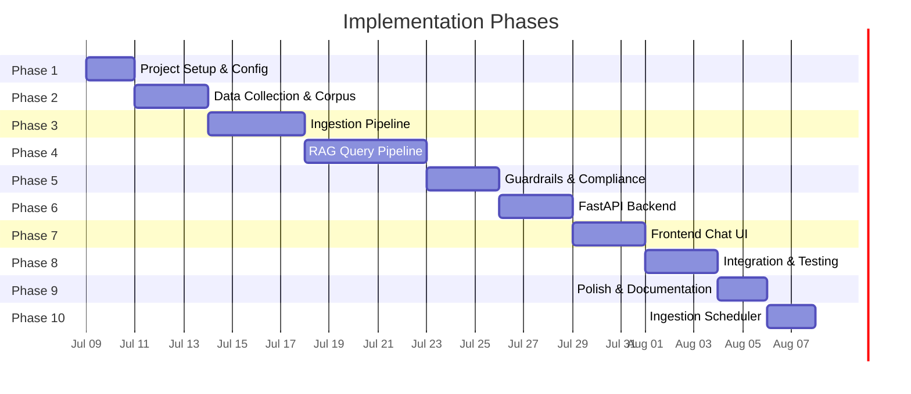
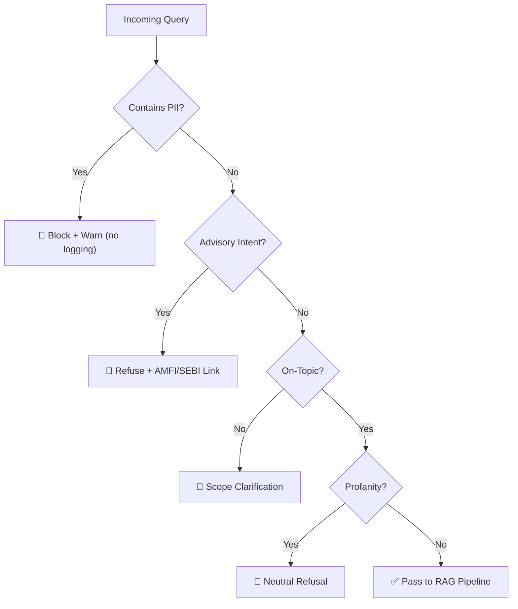

# Implementation Plan — Mutual Fund FAQ Assistant (RAG Chatbot)

> Phase-wise execution plan derived from [architecture.md](file:///d:/RAG_CHATBOT/architecture.md). Each phase is self-contained, testable, and builds on the previous one.

---

## Timeline Overview



| Phase | Name | Duration | Key Deliverable |
|-------|------|----------|-----------------|
| 1 | Project Setup & Configuration | 2 days | Runnable project skeleton with all dependencies |
| 2 | Data Collection & Corpus Building | 3 days | 15–25 curated URLs, downloaded raw data |
| 3 | Ingestion Pipeline | 4 days | Parsed, chunked, and indexed corpus in ChromaDB |
| 4 | RAG Query Pipeline | 5 days | End-to-end retrieval + LLM generation working |
| 5 | Guardrails & Compliance | 3 days | PII detection, advisory refusal, content filtering |
| 6 | FastAPI Backend & API | 3 days | REST API serving chat + health endpoints |
| 7 | Frontend Chat UI | 3 days | Functional chat interface with disclaimer |
| 8 | Integration & End-to-End Testing | 3 days | All components wired; test suite passing |
| 9 | Polish, Docs & Deployment Prep | 2 days | README, final QA, optional Docker |
| 10 | Ingestion Scheduler | 2 days | Daily GitHub Actions workflow and orchestrator script |

**Total estimated duration: ~33 days**

---

## Phase 1 — Project Setup & Configuration

> **Goal:** Establish the project skeleton, install dependencies, and set up environment configuration.

### 1.1 Tasks

| # | Task | Files Created/Modified |
|---|------|----------------------|
| 1.1 | Create project directory structure as defined in architecture | All directories |
| 1.2 | Initialize Python virtual environment | `venv/` |
| 1.3 | Create `requirements.txt` with all dependencies | `requirements.txt` |
| 1.4 | Create `.env.example` with required environment variables | `.env.example` |
| 1.5 | Create `src/config.py` — centralized configuration | `src/config.py` |
| 1.6 | Create `__init__.py` files for all packages | `src/*/__init__.py` |
| 1.7 | Create `.gitignore` | `.gitignore` |
| 1.8 | Verify `pip install -r requirements.txt` succeeds | — |

### 1.2 Dependencies (`requirements.txt`)

```
# Core
fastapi==0.115.*
uvicorn[standard]==0.30.*
python-dotenv==1.0.*
pydantic==2.8.*

# RAG Pipeline
langchain==0.2.*
langchain-community==0.2.*
langchain-groq==0.1.*
chromadb==0.5.*
sentence-transformers==3.0.*

# Data Ingestion
beautifulsoup4==4.12.*
requests==2.32.*
PyMuPDF==1.24.*
pdfplumber==0.11.*

# Utilities
tiktoken==0.7.*

# Testing
pytest==8.2.*
httpx==0.27.*
```

### 1.3 Configuration (`src/config.py`)

```python
# Key settings to externalize
GROQ_API_KEY            # Groq API key
EMBEDDING_MODEL_NAME    # "BAAI/bge-small-en-v1.5"
RERANKER_MODEL_NAME     # "cross-encoder/ms-marco-MiniLM-L-6-v2"
CHROMA_PERSIST_DIR      # "./vectorstore/chroma_db"
CHUNK_SIZE              # 500
CHUNK_OVERLAP           # 50
TOP_K                   # 5
SIMILARITY_THRESHOLD    # 0.65
```

### 1.4 Exit Criteria

- [ ] `pip install -r requirements.txt` completes without errors
- [ ] `python -c "from src.config import *"` imports successfully
- [ ] Directory structure matches architecture specification

---

## Phase 2 — Data Collection & Corpus Building

> **Goal:** Curate the 5 Groww scheme page URLs and set up the data directory for the HDFC schemes.

### 2.1 Tasks

| # | Task | Output |
|---|------|--------|
| 2.1 | Register 5 Groww scheme page URLs | `data/metadata.json` |
| 2.2 | Create `data/raw/groww/` directory structure | `data/raw/groww/` |
| 2.3 | Manual review: ensure all URLs are from `groww.in` only | — |

### 2.2 Source URL Registry (`data/metadata.json`)

```json
{
  "sources": [
    {
      "id": "groww_hdfc_midcap",
      "url": "https://groww.in/mutual-funds/hdfc-mid-cap-fund-direct-growth",
      "type": "scheme_page",
      "format": "html",
      "scheme": "HDFC Mid-Cap Fund – Direct Growth",
      "category": "Mid-Cap"
    }
  ],
  "corpus_stats": {
    "total_urls": 5,
    "html_sources": 5,
    "pdf_sources": 0,
    "last_collected": null
  }
}
```

### 2.3 Source URLs

| # | Scheme | Groww URL |
|---|---|---|
| 1 | HDFC Mid-Cap Fund – Direct Growth | [Link](https://groww.in/mutual-funds/hdfc-mid-cap-fund-direct-growth) |
| 2 | HDFC Equity Fund – Direct Growth | [Link](https://groww.in/mutual-funds/hdfc-equity-fund-direct-growth) |
| 3 | HDFC Focused Fund – Direct Growth | [Link](https://groww.in/mutual-funds/hdfc-focused-fund-direct-growth) |
| 4 | HDFC ELSS Tax Saver Fund – Direct Plan Growth | [Link](https://groww.in/mutual-funds/hdfc-elss-tax-saver-fund-direct-plan-growth) |
| 5 | HDFC Large Cap Fund – Direct Growth | [Link](https://groww.in/mutual-funds/hdfc-large-cap-fund-direct-growth) |

### 2.4 Exit Criteria

- [ ] `data/metadata.json` contains 5 entries
- [ ] All URLs are from `groww.in` domain
- [ ] Each of the 5 schemes has exactly 1 source URL
- [ ] Directory `data/raw/groww/` exists

---

## Phase 3 — Ingestion Pipeline

> **Goal:** Build the offline pipeline that parses, chunks, embeds, and indexes the corpus into ChromaDB.

### 3.1 Tasks

| # | Task | File |
|---|------|------|
| 3.1 | Implement HTML web scraper (Groww pages) | `src/ingestion/scraper.py` |
| 3.2 | Implement text chunker (RecursiveCharacterTextSplitter) | `src/ingestion/chunker.py` |
| 3.3 | Implement embedding + ChromaDB indexer | `src/ingestion/indexer.py` |
| 3.4 | Create orchestration script | `scripts/run_ingestion.py` |
| 3.5 | Create vector store verification script | `scripts/verify_vectorstore.py` |
| 3.6 | Run full ingestion and verify stored chunks | — |

### 3.2 Component Details

#### `scraper.py`

```
Input:  Groww scheme page URL
Output: Cleaned text + metadata dict

Steps:
  1. Fetch page with requests (+ user-agent header)
  2. Parse with BeautifulSoup
  3. Extract main content (remove nav, footer, ads)
  4. Return (clean_text, metadata)
```

#### `chunker.py`

```
Input:  Full document text + metadata (structured JSON flattened to natural-language paragraphs)
Output: List of chunk dicts with text + metadata

Chunking Strategy:
  - Section-based semantic paragraph chunking: The scraper flattens the structured JSON data 
    into natural-language paragraphs representing logical sections (e.g., Scheme Info, Costs, AUM, 
    Investment Limits & Lock-in, Returns, Top Holdings, Managers, Tax Rules), separated by '\n\n'.
  - Chunker splits at paragraph boundaries ('\n\n') using RecursiveCharacterTextSplitter.
  - Using chunk_size=500 characters and chunk_overlap=50 characters ensures that each section 
    paragraph (averaging 300-400 characters) remains fully self-contained in a single chunk, 
    avoiding slicing values (like NAV or expense ratios) across boundary lines.
  - This generates ~7 high-quality chunks per scheme (total 35 chunks for 5 schemes).
```

#### `indexer.py`

```
Input:  List of chunk dicts
Output: ChromaDB collection (persisted to disk)

Embedding Strategy:
  - Model: BAAI/bge-small-en-v1.5 (384 dimensions, cosine distance space).
  - Query Instruction Prefix: As BGE is a bi-encoder retrieval model, query embeddings must be 
    prefixed with "Represent this sentence for searching relevant passages: " to align query 
    semantics with passage semantics. Document chunks do not receive any prefix.
  - Distance Metric: Cosine similarity.
  - Storage: Upsert semantics based on unique chunk IDs to avoid duplicate indexing on re-runs.
    Metadata is sanitized to ChromaDB-safe types (str, int, float, bool) to support fast filtering.
```

### 3.3 Exit Criteria

- [ ] `python scripts/run_ingestion.py` completes without errors
- [ ] `python scripts/verify_vectorstore.py` reports 30–100 chunks indexed
- [ ] Each chunk has complete metadata (scheme_name, source_url, ingestion_date)
- [ ] Sample similarity query returns relevant chunks

---

## Phase 4 — RAG Query Pipeline

> **Goal:** Build the core retrieval + generation pipeline that takes a user query and returns a grounded answer.

### 4.1 Tasks

| # | Task | File |
|---|------|------|
| 4.1 | Implement vector retriever (cosine similarity, top-K=5) | `src/pipeline/retriever.py` |
| 4.2 | Add cross-encoder re-ranking (top 3 after re-rank) | `src/pipeline/retriever.py` |
| 4.3 | Implement prompt builder (system prompt + context + query) | `src/pipeline/prompt_builder.py` |
| 4.4 | Implement LLM response generator (Groq — llama-3.3-70b-versatile) | `src/pipeline/generator.py` |
| 4.5 | Implement post-processor (citation, footer, length) | `src/pipeline/postprocessor.py` |
| 4.6 | Wire pipeline components into a single RAG chain | `src/pipeline/` |
| 4.7 | Test with 10 sample factual queries | — |

### 4.2 Component Details

#### `retriever.py`

Detailed Retrieval Strategy:
1. **Query Preprocessing & Instruction Prefix**:
   Since the bi-encoder `BAAI/bge-small-en-v1.5` is trained as an asymmetric retriever, search queries must be prefixed with:
   `"Represent this sentence for searching relevant passages: "`
   This aligns query embeddings with document chunk embeddings (which were indexed without any prefix).
2. **Dense Vector Search**:
   Query the persistent ChromaDB collection `mutual_fund_faq` to retrieve the top `TOP_K = 5` matches.
3. **Similarity Score Calculation**:
   ChromaDB uses cosine distance $d$. Compute similarity score $s$ for each candidate chunk using:
   $s = 1.0 - d$
4. **Similarity Threshold Filtering**:
   Compare similarity scores to `SIMILARITY_THRESHOLD = 0.65`.
   Keep only candidates where $s \ge 0.65$.
   - If no candidates survive, return an empty list immediately. (This enables the downstream generator to short-circuit and return the fallback message: `"I don't have enough information to answer this from my sources."`)
5. **Cross-Encoder Re-Ranking**:
   For candidates passing the similarity threshold:
   - Instantiate the Cross-Encoder model using the `sentence-transformers` library and load `"cross-encoder/ms-marco-MiniLM-L-6-v2"`.
   - Compute scores for all `(query, document_text)` pairs.
   - Sort the candidates in descending order of their Cross-Encoder scores.
   - Return the top `RERANK_TOP_N = 3` re-ranked chunks.

#### `prompt_builder.py`

```python
class PromptBuilder:
    """
    Constructs the full prompt:
    - System prompt (rules, constraints)
    - Retrieved context (top-3 chunks with metadata)
    - User query
    
    Ensures total prompt ≤ 1K tokens context window
    """
```

#### `generator.py`

```python
class Generator:
    """
    Manages Groq API calls under strict rate limits:
    - RPM (30), RPD (1K), TPM (12K), TPD (100K)
    
    Mitigations:
    1. Local short-circuit: Guardrails intercept and refuse queries offline, saving API quota.
    2. Strict context window: Limits context inputs using prompt_builder to keep transaction size under ~700 tokens.
    3. Automatic backoff/retry: Integrates LangChain's retry wrapper + tenacity handler for HTTP 429 Rate Limit responses.
    4. In-memory LRU Cache: Bypasses Groq calls entirely for identical repeated user queries.
    """
```

#### `postprocessor.py`

```python
class PostProcessor:
    """
    1. Validate citation URL exists in chunk metadata
    2. Enforce ≤ 3 sentence limit
    3. Append "Last updated from sources: <date>" footer
    4. Structure final response JSON
    """
```

### 4.3 Sample Test Queries

| # | Query | Expected Source |
|---|-------|----------------|
| 1 | What is the expense ratio of HDFC Mid-Cap Fund? | Factsheet / Groww |
| 2 | What is the exit load for HDFC Equity Fund? | Factsheet / KIM |
| 3 | What is the minimum SIP amount for HDFC Large Cap Fund? | Groww / Factsheet |
| 4 | What is the lock-in period for HDFC ELSS Tax Saver? | KIM / SID |
| 5 | What is the benchmark index of HDFC Focused Fund? | Factsheet |
| 6 | What is the riskometer category of HDFC Mid-Cap Fund? | Factsheet |
| 7 | Who is the fund manager of HDFC Equity Fund? | Factsheet |
| 8 | How to download capital gains statement? | AMC FAQ |
| 9 | What is the AUM of HDFC Large Cap Fund? | Factsheet |
| 10 | What is the minimum lump sum investment for HDFC Focused Fund? | KIM / Groww |

### 4.4 Exit Criteria

- [ ] All 10 sample queries return relevant, grounded answers
- [ ] Every response includes exactly one valid citation URL
- [ ] Every response includes the "Last updated" footer
- [ ] No response exceeds 3 sentences
- [ ] Fallback message triggers when query is unanswerable from corpus

---

## Phase 5 — Guardrails & Compliance

> **Goal:** Implement the safety layer that blocks advisory queries, PII, and off-topic inputs before they reach the RAG pipeline.

### 5.1 Tasks

| # | Task | File |
|---|------|------|
| 5.1 | Implement PII detection (PAN, Aadhaar, phone, email, OTP) | `src/pipeline/guardrails.py` |
| 5.2 | Implement advisory query detection (keyword + pattern) | `src/pipeline/guardrails.py` |
| 5.3 | Implement off-topic / profanity detection | `src/pipeline/guardrails.py` |
| 5.4 | Build refusal response templates | `src/pipeline/guardrails.py` |
| 5.5 | Write unit tests for all guardrail checks | `tests/test_guardrails.py` |

### 5.2 Guardrails Decision Matrix



### 5.3 Test Cases

| Category | Input | Expected Result |
|---|---|---|
| PII - PAN | "My PAN is ABCDE1234F" | Block + warn |
| PII - Aadhaar | "Aadhaar 1234 5678 9012" | Block + warn |
| PII - Phone | "Call me at 9876543210" | Block + warn |
| PII - Email | "Send to user@mail.com" | Block + warn |
| Advisory | "Should I invest in HDFC Mid-Cap?" | Refuse + AMFI link |
| Advisory | "Which fund gives better returns?" | Refuse + AMFI link |
| Advisory | "Is this fund safe to invest?" | Refuse + AMFI link |
| Off-topic | "What's the weather today?" | Scope clarification |
| Factual ✅ | "What is the expense ratio of HDFC Mid-Cap?" | Pass through |
| Factual ✅ | "What is the lock-in period for ELSS?" | Pass through |

### 5.4 Exit Criteria

- [ ] All PII patterns detected correctly (0 false negatives on test set)
- [ ] All advisory queries refused (0 false negatives on test set)
- [ ] Factual queries pass through without false positives
- [ ] `pytest tests/test_guardrails.py` — all tests pass
- [ ] Blocked PII queries are never logged

---

## Phase 6 — FastAPI Backend & API

> **Goal:** Expose the RAG pipeline and guardrails through a REST API.

### 6.1 Tasks

| # | Task | File |
|---|------|------|
| 6.1 | Define Pydantic request/response models | `src/api/models.py` |
| 6.2 | Implement `POST /api/chat` endpoint | `src/api/routes.py` |
| 6.3 | Implement `GET /api/health` endpoint | `src/api/routes.py` |
| 6.4 | Create FastAPI app with CORS, static files | `src/api/main.py` |
| 6.5 | Wire guardrails → RAG pipeline in route handler | `src/api/routes.py` |
| 6.6 | Add error handling & logging | `src/api/main.py` |
| 6.7 | Test API with `httpx` / curl | `tests/test_e2e.py` |

### 6.2 Pydantic Models

```python
# Request
class ChatRequest(BaseModel):
    query: str                          # User's question
    session_id: Optional[str] = None    # Optional session tracking

# Response — Factual
class ChatResponse(BaseModel):
    status: str          # "success" | "refused"
    type: str            # "factual" | "advisory" | "pii" | "off_topic"
    answer: str          # The response text
    citation: Optional[Citation]       # URL + title
    educational_link: Optional[Link]   # For refusals
    footer: str          # Last updated or disclaimer
    confidence: Optional[float]        # Retrieval confidence

# Health
class HealthResponse(BaseModel):
    status: str
    vectorstore_docs: int
    last_ingestion: str
    model: str
```

### 6.3 API Route Flow

```
POST /api/chat
  │
  ├─ Parse ChatRequest
  ├─ Run Guardrails
  │   ├─ BLOCKED → return ChatResponse(status="refused", ...)
  │   └─ PASSED ↓
  ├─ Run RAG Pipeline (retrieve → rerank → generate → postprocess)
  ├─ Build ChatResponse(status="success", ...)
  └─ Return JSON
```

### 6.4 Exit Criteria

- [ ] `uvicorn src.api.main:app --reload` starts without errors
- [ ] `POST /api/chat` returns correct JSON for factual queries
- [ ] `POST /api/chat` returns refusal JSON for advisory queries
- [ ] `GET /api/health` returns vector store stats
- [ ] CORS headers allow frontend origin
- [ ] Error responses return proper HTTP status codes

---

## Phase 7 — Frontend Chat UI

> **Goal:** Build a minimal, clean chat interface with disclaimer, welcome message, and example questions.

### 7.1 Tasks

| # | Task | File |
|---|------|------|
| 7.1 | Create HTML structure (header, chat area, input) | `frontend/index.html` |
| 7.2 | Style the interface (dark/light theme, responsive) | `frontend/style.css` |
| 7.3 | Implement chat logic (send query, render response) | `frontend/app.js` |
| 7.4 | Add welcome message on load | `frontend/app.js` |
| 7.5 | Add 3 clickable example questions | `frontend/app.js` |
| 7.6 | Display disclaimer banner | `frontend/index.html` |
| 7.7 | Render citations as clickable links | `frontend/app.js` |
| 7.8 | Render refusal messages with educational links | `frontend/app.js` |
| 7.9 | Add loading spinner during API call | `frontend/app.js` |
| 7.10 | Mount static files in FastAPI | `src/api/main.py` |

### 7.2 UI Components

```
┌─────────────────────────────────────────────┐
│  🏦 HDFC Mutual Fund FAQ Assistant          │
│  ⚠️ Facts-only. No investment advice.       │
├─────────────────────────────────────────────┤
│                                             │
│  👋 Welcome! I can answer factual questions │
│     about HDFC mutual fund schemes.         │
│                                             │
│  Try asking:                                │
│  ┌─────────────────────────────────────┐    │
│  │ What is the expense ratio of HDFC   │    │
│  │ Mid-Cap Fund – Direct Growth?       │    │
│  └─────────────────────────────────────┘    │
│  ┌─────────────────────────────────────┐    │
│  │ What is the lock-in period for HDFC │    │
│  │ ELSS Tax Saver Fund?               │    │
│  └─────────────────────────────────────┘    │
│  ┌─────────────────────────────────────┐    │
│  │ How do I download my capital gains  │    │
│  │ statement from HDFC AMC?            │    │
│  └─────────────────────────────────────┘    │
│                                             │
│  ─ ─ ─ ─ ─ ─ ─ ─ ─ ─ ─ ─ ─ ─ ─ ─ ─ ─ ─  │
│                                             │
│  🧑 What is the exit load for HDFC Equity?  │
│                                             │
│  🤖 The exit load for HDFC Equity Fund –    │
│     Direct Growth is 1% if redeemed within  │
│     1 year from the date of allotment.      │
│     🔗 Source: HDFC AMC Factsheet           │
│     📅 Last updated from sources: 2026-07-08│
│                                             │
├─────────────────────────────────────────────┤
│  [Type your question...          ] [Send ➤] │
└─────────────────────────────────────────────┘
```

### 7.3 Exit Criteria

- [ ] UI loads at `http://localhost:8000` with welcome message
- [ ] Disclaimer banner is always visible
- [ ] 3 example questions are clickable and auto-submit
- [ ] User messages and bot responses render correctly
- [ ] Citations display as clickable links
- [ ] Refusal messages render with educational links
- [ ] Loading state shown during API call
- [ ] Responsive on mobile viewports

---

## Phase 8 — Integration & End-to-End Testing

> **Goal:** Wire all components together and validate the complete flow with automated and manual tests.

### 8.1 Tasks

| # | Task | File |
|---|------|------|
| 8.1 | End-to-end integration test (UI → API → RAG → Response) | `tests/test_e2e.py` |
| 8.2 | Guardrails unit tests (expanded) | `tests/test_guardrails.py` |
| 8.3 | Retriever unit tests | `tests/test_retriever.py` |
| 8.4 | Generator unit tests | `tests/test_generator.py` |
| 8.5 | Manual QA: test all 10 sample queries via UI | — |
| 8.6 | Manual QA: test all refusal scenarios via UI | — |
| 8.7 | Performance profiling (query latency < 3s target) | — |
| 8.8 | Fix bugs discovered during testing | Various |

### 8.2 Test Matrix

#### Automated Tests (`pytest`)

| Test File | Scope | Test Count |
|---|---|---|
| `test_guardrails.py` | PII, advisory, off-topic, passthrough | ~15 tests |
| `test_retriever.py` | Embedding, search, re-ranking, threshold | ~8 tests |
| `test_generator.py` | Prompt building, response format, fallback | ~6 tests |
| `test_e2e.py` | Full API round-trip (factual + refusal) | ~10 tests |

#### Manual QA Checklist

| # | Scenario | Expected | Pass? |
|---|----------|----------|-------|
| 1 | Factual query → correct answer with citation | ✅ | |
| 2 | Advisory query → polite refusal | ✅ | |
| 3 | PII in query → block + warn | ✅ | |
| 4 | Off-topic query → scope message | ✅ | |
| 5 | Unanswerable query → fallback message | ✅ | |
| 6 | Click example question → correct answer | ✅ | |
| 7 | Response ≤ 3 sentences | ✅ | |
| 8 | Citation URL is valid and clickable | ✅ | |
| 9 | Footer shows "Last updated" date | ✅ | |
| 10 | UI responsive on mobile | ✅ | |

### 8.3 Exit Criteria

- [ ] `pytest tests/` — all tests pass (0 failures)
- [ ] All 10 manual QA scenarios verified
- [ ] Average query latency < 3 seconds
- [ ] No PII leakage in logs
- [ ] No advisory responses slip through guardrails

---

## Phase 9 — Polish, Documentation & Deployment Prep

> **Goal:** Finalize documentation, clean up code, and prepare for deployment.

### 9.1 Tasks

| # | Task | File |
|---|------|------|
| 9.1 | Write comprehensive README | `README.md` |
| 9.2 | Add docstrings to all modules and functions | `src/**/*.py` |
| 9.3 | Create `.env.example` with all required variables | `.env.example` |
| 9.4 | Final code cleanup (remove debug prints, unused imports) | Various |
| 9.5 | Create Dockerfile (optional) | `Dockerfile` |
| 9.6 | Final round of manual QA | — |
| 9.7 | Tag release `v1.0.0` | — |

### 9.2 README Structure

```markdown
# HDFC Mutual Fund FAQ Assistant

## Overview
## Selected AMC & Schemes
## Architecture
## Setup Instructions
  ### Prerequisites
  ### Installation
  ### Environment Variables
  ### Running Ingestion
  ### Starting the Server
## Usage
  ### Example Queries
  ### API Endpoints
## Constraints & Disclaimer
## Known Limitations
## License
```

### 9.3 Exit Criteria

- [ ] README covers setup end-to-end (clone → running chatbot)
- [ ] All Python modules have docstrings
- [ ] `.env.example` lists all required variables
- [ ] `python scripts/run_ingestion.py` + `uvicorn` works from a fresh clone
- [ ] Disclaimer "Facts-only. No investment advice." is visible in UI

---

## Phase 10 — Ingestion Scheduler

> **Goal:** Develop a scheduled GitHub Actions workflow to pull fresh mutual fund details, extract content, and update the vector store daily.

### 10.1 Tasks

| # | Task | Files Created/Modified |
|---|------|------------------------|
| 10.1 | Create orchestrator script `scripts/trigger_ingestion.py` to chain pipeline runs | `scripts/trigger_ingestion.py` |
| 10.2 | Create GitHub Actions workflow `.github/workflows/daily_ingestion.yml` | `.github/workflows/daily_ingestion.yml` |
| 10.3 | Update `/api/health` endpoint schema to read last ingestion timestamp from `data/metadata.json` | `src/api/routes.py`, `src/api/models.py` |
| 10.4 | Write tests for the integration orchestrator `scripts/trigger_ingestion.py` | `tests/test_trigger_ingestion.py` |
| 10.5 | Add workflow documentation in the README for manually running the action | `README.md` |

### 10.2 Component Details

#### `trigger_ingestion.py`
A python script running the ingestion pipeline sequentially:
1. `download_sources.py`
2. `extract_text.py`
3. `run_ingestion.py`

#### `daily_ingestion.yml`
A GitHub Actions workflow configured with:
- `schedule` event triggering daily (e.g., `0 0 * * *` UTC)
- `workflow_dispatch` event for manual execution
- Job steps to checkout repo, set up Python, install dependencies, run `scripts/trigger_ingestion.py`, and commit and push updated data/vectorstore files back to the repository.

### 10.3 Exit Criteria

- [x] `python scripts/trigger_ingestion.py` executes full flow without exceptions
- [x] GitHub Actions workflow file `.github/workflows/daily_ingestion.yml` passes yaml linting
- [x] Local run updates `data/metadata.json` and ChromaDB with new timestamps
- [x] Tests in `tests/test_trigger_ingestion.py` verify full sequential execution and correct return codes

---

## Phase Dependencies

```mermaid
flowchart LR
    P1["Phase 1: Setup"] --> P2["Phase 2: Data Collection"]
    P2 --> P3["Phase 3: Ingestion Pipeline"]
    P3 --> P4["Phase 4: RAG Pipeline"]
    P4 --> P5["Phase 5: Guardrails"]
    P4 --> P6["Phase 6: FastAPI Backend"]
    P5 --> P6
    P6 --> P7["Phase 7: Frontend UI"]
    P7 --> P8["Phase 8: Integration Testing"]
    P8 --> P9["Phase 9: Polish & Docs"]
    P9 --> P10["Phase 10: Ingestion Scheduler"]

    style P3 fill:#4CAF50,color:#fff
    style P4 fill:#2196F3,color:#fff
    style P5 fill:#FF9800,color:#fff
    style P10 fill:#9C27B0,color:#fff
```



> [!NOTE]
> **Phase 5 (Guardrails) and Phase 6 (Backend) can partially overlap** — guardrails can be developed while the API skeleton is being built, as long as the RAG pipeline (Phase 4) is complete.

---

## Risk Register

| Risk | Impact | Likelihood | Mitigation |
|---|---|---|---|
| Groww blocks web scraping | High | Medium | Cache raw HTML; use official AMC site as fallback |
| HDFC AMC factsheet PDFs have complex layouts | Medium | High | Use `pdfplumber` for tables; manual QA on key data |
| Groq API rate limits during testing & production | Medium | Low | Implement offline guardrail pruning, strict context size limits (~700 tokens/request), cache identical queries, and configure LangChain's request retries with exponential backoff (limits: 30 RPM, 1K RPD, 12K TPM, 100K TPD) |
| LLM generates hallucinated facts | High | Medium | Post-processing cross-checks; strict system prompt |
| Embedding model quality insufficient | Medium | Low | Benchmark with test queries; swap to `BAAI/bge-base-en-v1.5` (768-dim) if needed |
| ChromaDB persistence issues | Medium | Low | Verify persistence after each ingestion run |

---

## Quick Reference — Files per Phase

| File | Phase |
|------|-------|
| `requirements.txt` | 1 |
| `.env.example` | 1, 9 |
| `src/config.py` | 1 |
| `.gitignore` | 1 |
| `data/metadata.json` | 2 |
| `data/raw/**` | 2 |
| `src/ingestion/scraper.py` | 3 |
| `src/ingestion/chunker.py` | 3 |
| `src/ingestion/indexer.py` | 3 |
| `scripts/run_ingestion.py` | 3 |
| `scripts/verify_vectorstore.py` | 3 |
| `src/pipeline/retriever.py` | 4 |
| `src/pipeline/prompt_builder.py` | 4 |
| `src/pipeline/generator.py` | 4 |
| `src/pipeline/postprocessor.py` | 4 |
| `src/pipeline/guardrails.py` | 5 |
| `src/api/models.py` | 6 |
| `src/api/routes.py` | 6 |
| `src/api/main.py` | 6 |
| `frontend/index.html` | 7 |
| `frontend/style.css` | 7 |
| `frontend/app.js` | 7 |
| `tests/test_guardrails.py` | 5, 8 |
| `tests/test_retriever.py` | 8 |
| `tests/test_generator.py` | 8 |
| `tests/test_e2e.py` | 8 |
| `README.md` | 9 |
| `scripts/trigger_ingestion.py` | 10 |
| `.github/workflows/daily_ingestion.yml` | 10 |
| `tests/test_trigger_ingestion.py` | 10 |
